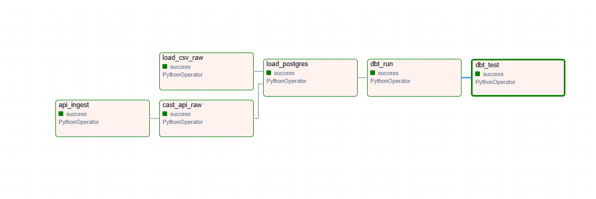

# Retail Analytics Data Pipeline

**[Live project page →](https://arnavmodi-msit.github.io/retail-analytics-pipeline/)** &nbsp;·&nbsp; **[Live dashboard →](https://app.powerbi.com/view?r=eyJrIjoiYzZkMTA2MzYtNjEzZi00Y2U3LWE2N2YtNDAwZTcwNmQ4Zjg3IiwidCI6IjNiMjk5M2Q3LTQ5YmYtNGYyOS1iNzk0LWRkNTcyN2Y0NWVlMiJ9)**

---

## What it does

An ELT pipeline for retail sales data. Two independent sources land in Postgres in their own native shape, untouched:

- **CSV** — [Online Retail II (UCI)](https://archive.ics.uci.org/dataset/502/online+retail+ii), ~1.07M UK e-commerce transactions, loaded as a historical bulk batch.
- **API** — [DummyJSON `/carts`](https://dummyjson.com/carts), pulled daily as a live incremental feed.

All transformation happens after that, entirely in dbt: cleaning, normalization, quality classification (`valid` / `return` / `quarantine`), and the star schema itself — version-controlled, tested SQL. PySpark's role is limited to extraction and type-casting. Nothing is silently dropped — quarantined and return rows stay queryable in `int_sales_classified`, they just don't reach the star schema.

## Architecture

```
CSV bulk ──▶ raw_csv_sales  ──┐
                                ├──▶ dbt: staging → intermediate → marts ──▶ Power BI
API daily ─▶ raw_api_carts ──┘        (normalize · classify · model)
```

Orchestrated by **Airflow** (Docker, LocalExecutor) — 6 tasks, 2 parallel ingestion branches converging through `load_postgres` into `dbt_run` → `dbt_test`, daily schedule, 3 retries, email alert on failure. A failed dbt test fails the DAG run.

| Stage | Tool | What happens |
|---|---|---|
| Ingest | Python / `requests` | CSV historical load + daily API pull, landed untouched |
| Load | PySpark + JDBC | Type casting only — each source lands in its own raw table, in its own native shape |
| Orchestrate | Airflow | Parallel branches merge before the dbt tasks |
| Transform (staging) | dbt | Light 1:1 cleanup per source — trimming, no filtering |
| Transform (intermediate) | dbt | API reshaped to match CSV's columns, sources unioned, every row classified `valid`/`return`/`quarantine` |
| Transform (marts) | dbt | Dimension dedup, surrogate keys (hashed, not auto-increment), star schema built from `valid` rows only. `fact_sales` is incremental (append-only) — dims stay full-rebuild |
| Test | dbt | Generic + singular tests — referential integrity, business-rule assertions, a WARN-level bound on the quarantine rate |
| Report | Power BI | Direct Postgres connection, Import mode |

## Data at a glance

| Metric | Value |
|---|---|
| Raw CSV rows landed | 1,067,371 |
| Valid CSV rows in `fact_sales` | 805,620 |
| Quarantined by dbt (documented, not dropped) | 22.7% |
| Daily API rows merged | 800 |
| Products (deduplicated by mode) | 4,820 |
| Unique customers | 6,089 |
| Countries | 42 |
| Total `fact_sales` rows | 806,420 |

## Star schema

Four dimensions (`dim_date`, `dim_product`, `dim_customer`, `dim_country`), one fact table (`fact_sales`) at invoice-line-item grain, all built and tested by dbt from `int_sales_classified`. A `source` column on the fact table tracks which pipeline branch each row came from. Dimension surrogate keys are deterministic hashes (`dbt_utils.generate_surrogate_key`) of the natural key, not auto-increment — dims rebuild from scratch every run, so keys can't depend on insertion order. `fact_sales` itself is incremental (`materialized='incremental'`, `append` strategy) — only rows newer than what's already loaded get processed each run, since invoice line items never change after landing.


### dbt lineage

```
raw_csv_sales ──▶ stg_csv_sales ─────────────────────┐
                                                        ├──▶ int_sales_unioned ──▶ int_sales_classified ──▶ dim_product / dim_customer / dim_country / fact_sales
raw_api_carts ──▶ stg_api_carts ──▶ int_api_carts_normalized ──┘                                                           ▲
                                                                                                      dim_date (dbt_utils.date_spine) ──┘
```

Run `dbt docs generate && dbt docs serve` from `dbt/` for the interactive version of this graph.

## Orchestration



## Getting started

**Prerequisites:** Docker Desktop, Python 3.11, PostgreSQL (local instance for the warehouse — separate from Airflow's own metadata Postgres, which runs in Docker).

```bash
git clone https://github.com/ArnavModi-MSIT/retail-analytics-pipeline.git
cd retail-analytics-pipeline

# Local Python environment (for running scripts directly / testing)
python -m venv .venv
.venv\Scripts\activate          # Windows
pip install -r requirements.txt

# Environment config — copy and fill in real values
cp .env.local.example .env          # for local `python` runs
cp .env.docker.example .env.docker  # for the Airflow containers

# Warehouse schema — raw landing table only; dbt builds everything else
psql -U postgres -d retail_analytics -f sql/ddl.sql

# dbt (star schema: dims + fact), separate venv — see dbt/
python -m venv .venv-dbt
.venv-dbt\Scripts\activate      # Windows
pip install -r dbt/requirements-dbt.txt
cd dbt && dbt deps && dbt run && dbt test

# Orchestration
docker compose up airflow-init
docker compose up -d
```

Airflow UI: `http://localhost:8080` (default `admin` / `admin`, set during `airflow-init`). Trigger `retail_analytics_pipeline` from the DAGs list.

## Testing

```bash
# Python side — type-casting logic + DAG structure
pip install -r requirements-dev.txt
ruff check .
pytest tests/ -v

# dbt side — the actual transformation logic (27 tests: generic + singular)
cd dbt && dbt test
```

CI runs lint, Python unit tests, DAG import validation, dbt (against a disposable Postgres service container, seeded with small fixture data — see `dbt/seeds/`), and a Docker build check on every push — see [`.github/workflows/ci.yml`](.github/workflows/ci.yml).

> PySpark's local worker sockets can be unreliable on native Windows (a known PySpark/Windows limitation). If `pytest` hangs or times out locally, trust CI's Ubuntu runner — the same suite passes cleanly there.

## Tech stack

Python · PySpark · dbt · Apache Airflow · PostgreSQL · Docker Compose · Power BI · GitHub Actions · pytest · ruff

## Project structure

```
├── dags/                  # Airflow DAG
├── ingestion/              # API ingestion + storage backend abstraction
├── transform/               # PySpark ingest + type-cast (E+L only, no business rules)
├── dbt/                       # All transformation — staging, intermediate, marts, tests
│   ├── models/
│   │   ├── staging/              # 1:1 cleanup per raw source
│   │   ├── intermediate/          # normalization, union, valid/return/quarantine classification
│   │   └── marts/                  # star schema (4 dims + fact_sales)
│   └── seeds/                    # small fixture data — CI only, never run against real data
├── sql/                      # DDL (raw landing tables only), migrations
├── tests/                     # pytest suite (type-casting, DAG import) — dbt owns transform-logic tests
├── docs/                       # GitHub Pages project site
├── docker-compose.yml
├── Dockerfile               # Airflow + JDK 17 (PySpark) + isolated dbt venv
└── .github/workflows/ci.yml
```
